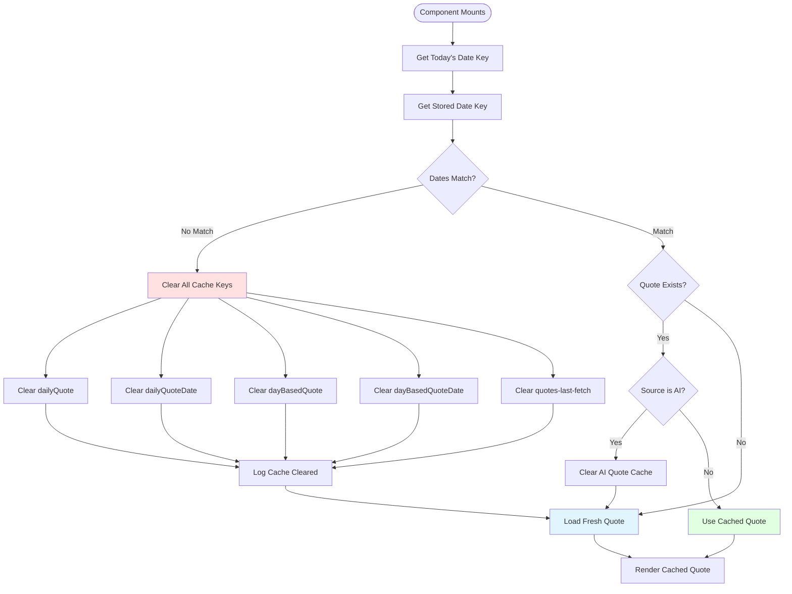
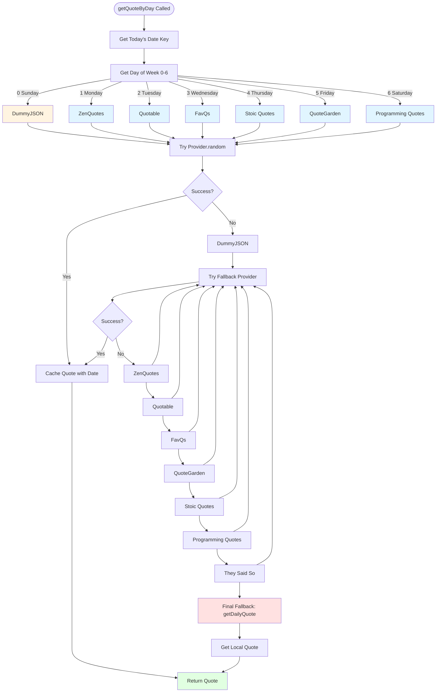
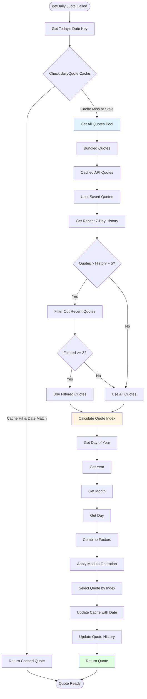
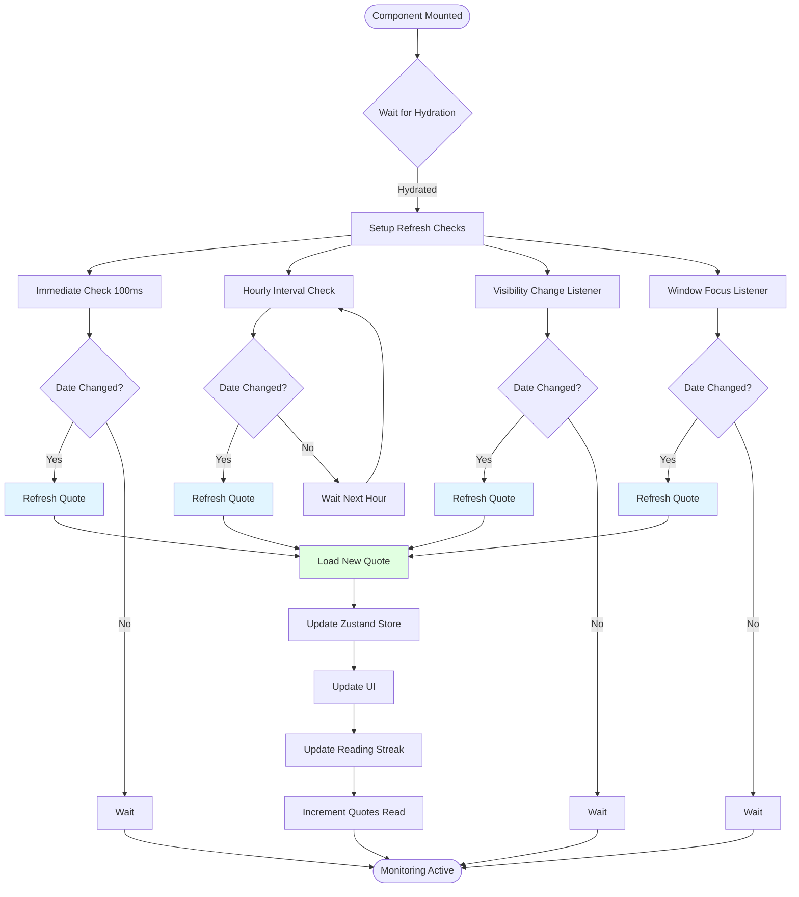
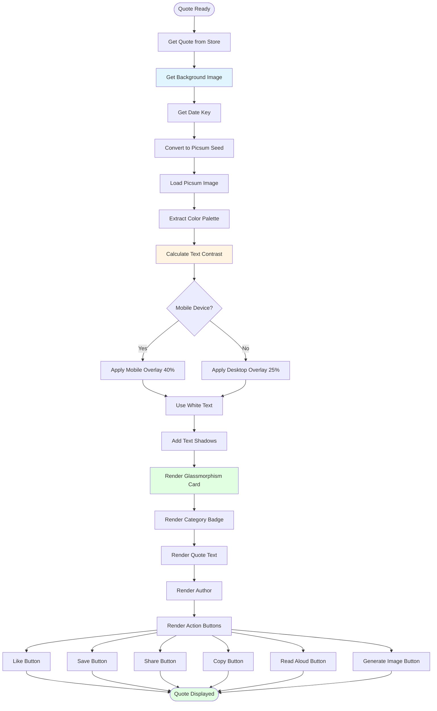

# Daily Quote System - Complete Flowchart

## Main Flow

```mermaid
flowchart TD
    Start([User Opens App]) --> Mount[TodayTab Component Mounts]
    Mount --> SyncCheck{Synchronous Cache Check}
    
    SyncCheck -->|Stale Date| ClearCache[Clear All Cache Keys]
    SyncCheck -->|Valid Date| CheckStore[Check Zustand Store]
    ClearCache --> CheckStore
    
    CheckStore -->|Quote Exists| RenderCached[Render Cached Quote]
    CheckStore -->|No Quote| LoadQuote[Load Quote via QuoteService]
    
    LoadQuote --> TryGetQuoteByDay{Try getQuoteByDay}
    TryGetQuoteByDay -->|Available| GetQuoteByDay[getQuoteByDay Method]
    TryGetQuoteByDay -->|Not Available| GetDailyQuote[getDailyQuote Method]
    
    GetQuoteByDay --> CheckForce{Force Refresh?}
    CheckForce -->|Yes| ClearDayCache[Clear dayBasedQuote Cache]
    CheckForce -->|No| CheckDayCache{Check dayBasedQuote Cache}
    
    ClearDayCache --> GetProvider
    CheckDayCache -->|Cache Hit & Date Match| ReturnCached[Return Cached Quote]
    CheckDayCache -->|Cache Miss or Stale| GetProvider[Get Today's Provider]
    
    GetProvider --> GetDayOfWeek[Get Day of Week 0-6]
    GetDayOfWeek --> SelectProvider[Select Provider from WEEKLY_SCHEDULE]
    SelectProvider --> ProviderAvailable{Provider Available?}
    
    ProviderAvailable -->|No| FallbackChain[Try Fallback Chain]
    ProviderAvailable -->|Yes| CallProvider[Call provider.random]
    
    CallProvider --> APISuccess{API Success?}
    APISuccess -->|Yes| CacheQuote[Cache Quote with Date Key]
    APISuccess -->|No| FallbackChain
    
    FallbackChain --> TryNext{More Providers?}
    TryNext -->|Yes| CallProvider
    TryNext -->|No| FallbackToLocal[Fallback to getDailyQuote]
    
    FallbackToLocal --> GetDailyQuote
    GetDailyQuote --> GetAllQuotes[Get All Quotes Pool]
    
    GetAllQuotes --> BundledQuotes[Bundled Quotes]
    BundledQuotes --> CachedAPI[Cached API Quotes]
    CachedAPI --> UserSaved[User Saved Quotes]
    
    UserSaved --> GetHistory[Get Recent 7-Day History]
    GetHistory --> EnoughQuotes{Enough Quotes?}
    
    EnoughQuotes -->|Yes| FilterRecent[Filter Out Recent Quotes]
    EnoughQuotes -->|No| UseAll[Use All Quotes]
    FilterRecent --> UseAll
    
    UseAll --> CalculateIndex[Calculate Quote Index from Date]
    CalculateIndex --> HashDate[djb2Hash Date Key]
    HashDate --> ModuloArray[Modulo Array Length]
    ModuloArray --> SelectQuote[Select Quote by Index]
    
    SelectQuote --> UpdateHistory[Update Quote History]
    UpdateHistory --> CacheWithDate[Cache with Date Key]
    CacheWithDate --> ReturnQuote[Return Quote]
    
    CacheQuote --> ReturnQuote
    ReturnCached --> ReturnQuote
    
    ReturnQuote --> UpdateStore[Update Zustand Store]
    UpdateStore --> RenderCard[Render Quote Card]
    
    RenderCard --> AutoTheme[Auto-Theme Background]
    AutoTheme --> CalculateContrast[Calculate Text Contrast]
    CalculateContrast --> ApplyStyles[Apply Glassmorphism Styles]
    ApplyStyles --> DisplayQuote[Display Quote + Actions]
    
    DisplayQuote --> End([User Sees Quote])
    
    style GetQuoteByDay fill:#e1f5ff
    style GetProvider fill:#fff4e1
    style FallbackToLocal fill:#ffe1e1
    style RenderCard fill:#e1ffe1
    style DisplayQuote fill:#e1ffe1
```

## Cache Invalidation Flow

## Provider Selection Flow

## Quote Selection Algorithm (Local Fallback)

## Auto-Refresh Mechanism

## UI Rendering Flow

---

## Legend

- **Blue boxes**: Data fetching/processing
- **Yellow boxes**: Decision points/calculations
- **Green boxes**: Successful completion
- **Red boxes**: Fallback/error handling
- **Orange boxes**: Cache operations

---

## Key Insights

1. **Dual-Path Architecture**: Primary path (API) with fallback (local)
2. **Multiple Cache Layers**: Date-based invalidation at multiple levels
3. **Deterministic Selection**: Same quote for all users on same day
4. **Repetition Avoidance**: 7-day history filtering
5. **Auto-Refresh**: Multiple triggers ensure date changes are caught
6. **Graceful Degradation**: Always returns a quote, even if APIs fail

---

**Generated:** 2024-01-15
**Status:** Complete

